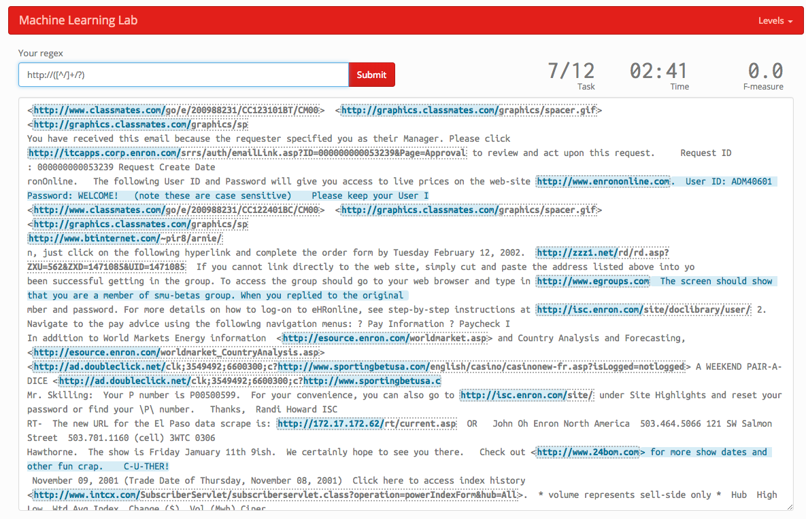
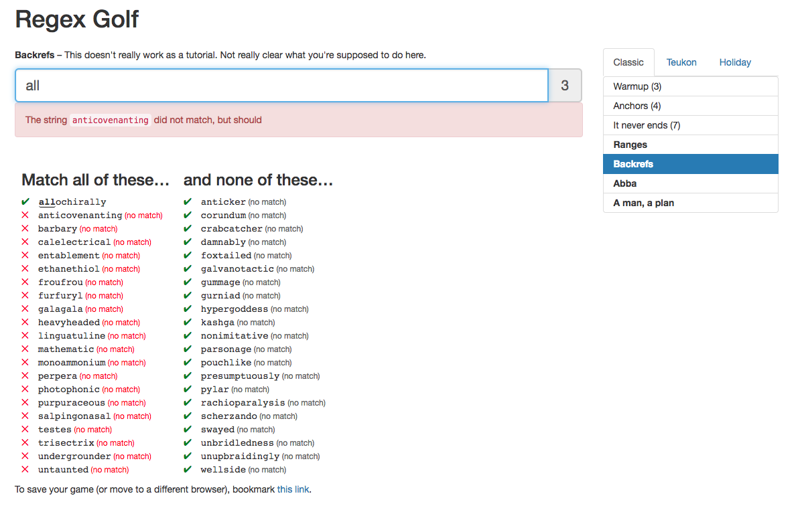
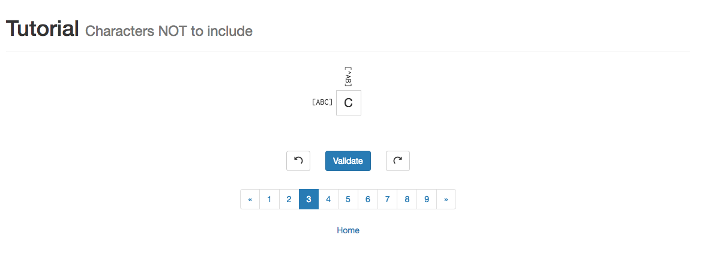

# 正则表达式

## 基本语法

想要了解正则表达式的语法，强烈推荐这个网站：[RegExr: Learn, Build, & Test RegEx](https://regexr.com/)

### Character Classes

|  |  |
| :--- | :--- |
| character set | `[ABC]` |
| negated set | `[^ABC]` |
| range | `[A-Z]` `[a-z]` `[0-9]` |
| dot | . |
| word | \w |
| not word | \W |
| digit | \d |
| not digit | \D |
| space | \s |
| not space | \S |

### Anchors

|  |  |
| :--- | :--- |
| beginning | ^ |
| end | $ |
| word boundary | \b |
| not word boundary | \B |

### Group

|  |  |
| :--- | :--- |
| capturing group | \(ABC\) |
| non-capturing group | \(?:ABC\) |
| numeric refernce | \1 |

### Lookaround

|  |  |
| :--- | :--- |
| positive lookahead | \(?=ABC\) |
| negative lookahead | \(?!ABC\) |

// others to complete

## 在实战中提高正则表达式的熟练度

推荐一下几个网站

* [RegexPlay](http://play.inginf.units.it/#/sheet) 提供多种关卡，完成每个level，从菜鸟成长为大师

* [RegexGolf](https://alf.nu/RegexGolf) 个人觉得这个网站有点变态，主要在于需要惊人的观察力...

* [Regex Cross­word](https://regexcrossword.com/) 讲道理这个我一直没搞懂玩法，不过要是能通关，肯定很棒棒...

