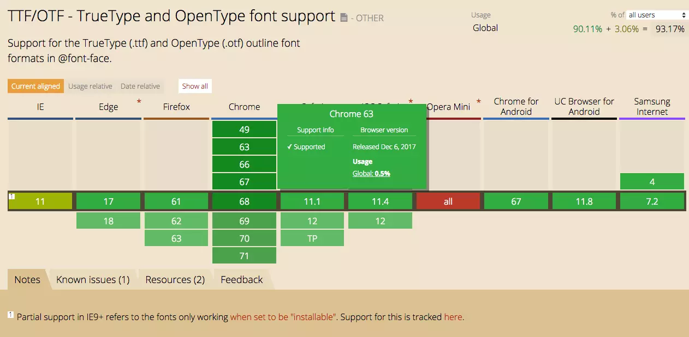
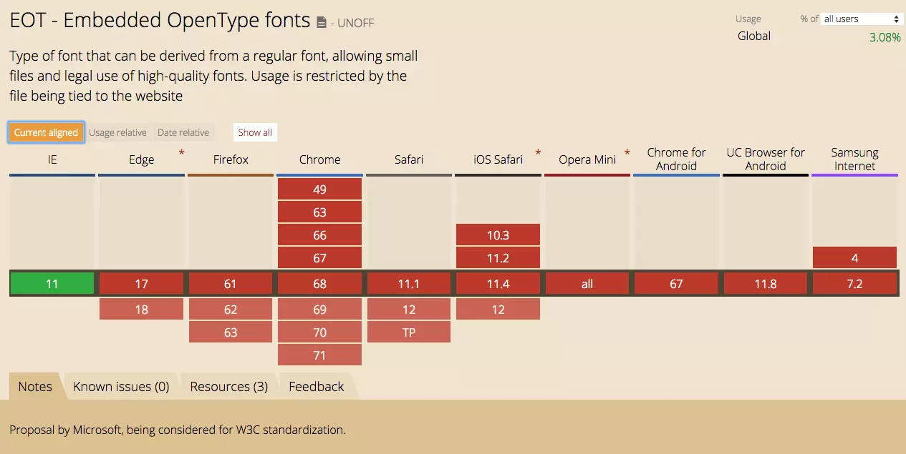
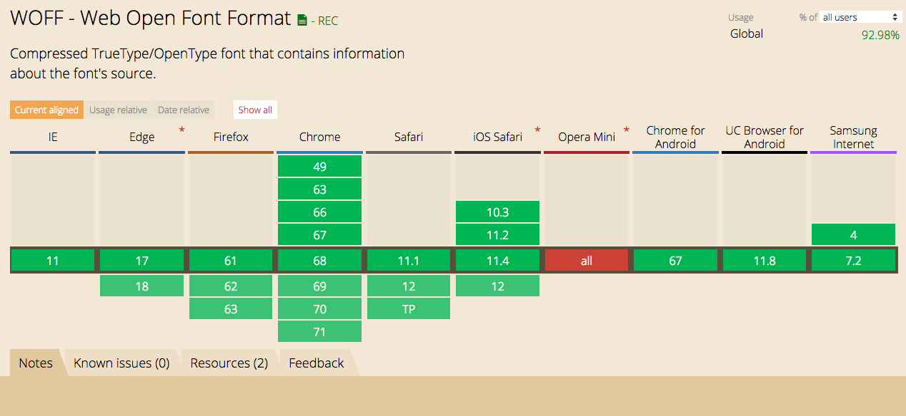

# font-face小记

## 简单对比

| Type | Ext | Desc |
| :--- | :--- | :--- |
| True Type Font | ttf | 苹果和微软共同开发。体积较大。应用范围广 |
| Open Type Font | otf | Adobe和微软共同开发。由ISO组织制定了Open Font Format \(off\) 标准 |
| Embedded OpenType | eot | 对otf的压缩，但是比ttf文件更大。设计初衷是为了适应移动端 |
| Web Open Font Format | woff | Mozilla基金会，Opera Software以及微软主导。体积小，12年开始成为w3c推荐标准。 |

## 兼容性

### [TTF/OTF](https://caniuse.com/#search=ttf)

多数浏览器都支持。早期的安卓（2.1）和ios（3.2/4.1）不支持。

IE支持度不佳。

### [EOT](https://caniuse.com/#search=eot)

目前只有IE支持，可以兼容到IE6，edge都不支持。

对于eot的话，没有特殊要求就可以放弃治疗了。

### [WOFF](https://caniuse.com/#search=woff)

与TTF/OTF相比，桌面端的兼容性差不多。

低版本安卓和ios兼容情况较差。

