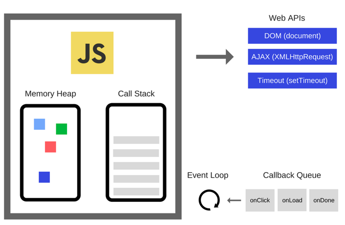

# Event Loop

> [阮一峰：event loop](http://www.ruanyifeng.com/blog/2014/10/event-loop.html)
>
> [how javascript works](http://www.zcfy.cc/article/how-javascript-works-event-loop-and-the-rise-of-async-programming-5-ways-to-better-coding-with-4506.html)

## 图解

1. 主线程运行会产生堆（heap）和栈（stack）
2. **Tick** 主线程的代码都执行结束后，会从event-loop的任务队列里取出一个事件，推入call stack并执行。 当主线程的调用了一个异步的API（在浏览器中可能是AJAX请求，在node中可能是I/O操作），并设置了回调函数，当异步任务执行完成时，会往event-loop的任务队列里放进一个任务，等待主线程调用。 如此循环。每一个这样的循环，叫做tick。
3. **Job queue** es6中由于新增了promise，promise的执行作为es规范的一部分，有详细的定义。promise的链式调用执行是异步的，这个异步回调被期望尽可能快的调用。因此es6中提出了job queue的概念。 每一个job queue都在一个tick的结尾执行。如果job queue中有很多待执行的任务（同步任务），会导致event loop不会继续执行。

## v8的实现

* macrotasks macrotasks即包括主线程代码以及event-loop中的事件队列 主线程代码，setTimeout，setInterval， setImmediate
* microtasks microtasks即job queue，在每一个tick执行结束时执行 process.nextTick，promise，ObjectObserver，MutationObserver

