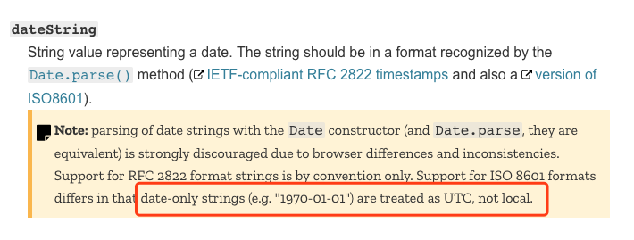

# Date

2018年11月19日 12:40:00

## TL;DR

1. `new Date("2018-11-19")` 和 `new Date("2018-11-19 00:00:00")` 的返回结果可能是不一样的。
2. 如果需要创建一个日期对象，且希望不同时区下创建的该对象，都能展示为同一天，尽量加上 `00:00:00` ,或者使用 `new Date(y, [m, [d， [...]]])`、 `moment("2018-11-19").toDate()`

## Background

在某个项目中，前后端通信的时候，后端返回给前端一个 形如 `yyyy-mm-dd hh:mm:ss` 的字符串，如下所示：


antd@1.x的datepicker需要一个date对象或者字符串作为初始值。如果我们要传date对象的话，就需要手动把上面的entry\_date字符串，转化为一个date对象。

> 为什么传date对象而不是字符串：因为antd@1.x用了一个GregoryDate库，这个库内部时间处理对时区、夏令时支持很不友好，容易出问题，所以antd@2.x之后已经改为了moment

## How to create a date instance

说起创建一个date对象，大家可能会想到new Date() 或者 Date()。不过只有前者才返回一个date对象，后者返回的是一个字符串。

那么下列代码分别会返回哪些值呢？：

```javascript
new Date("2018-11-19")
new Date("2018-11-19 00:00:00")
new Date(2018, 10, 19)
new Date(2018, 10, 19, 0, 0, 0)
```

如果我们在东八区执行下列代码，得到的结果如下（注意看参数和返回结果中时间的对应关系）：

```javascript
new Date("2018-11-19")
// Mon Nov 19 2018 08:00:00 GMT+0800 (中国标准时间)

new Date("2018-11-19 00:00:00")
// Mon Nov 19 2018 00:00:00 GMT+0800 (中国标准时间)

new Date(2018, 10, 19)
// Mon Nov 19 2018 00:00:00 GMT+0800 (中国标准时间)

new Date(2018, 10, 19, 0, 0, 0)
// Mon Nov 19 2018 00:00:00 GMT+0800 (中国标准时间)
```

第一项的时间似乎不太对劲，但是整体看来也没什么问题。 可是如果我们在西八区执行这段代码会怎样呢？

```javascript
new Date("2018-11-19")
// Sun Nov 18 2018 16:00:00 GMT-0800 (北美太平洋标准时间)

new Date("2018-11-19 00:00:00")
// Mon Nov 19 2018 00:00:00 GMT-0800 (北美太平洋标准时间)

new Date(2018, 10, 19)
// Mon Nov 19 2018 00:00:00 GMT-0800 (北美太平洋标准时间)

new Date(2018, 10, 19, 0, 0, 0)
// Mon Nov 19 2018 00:00:00 GMT-0800 (北美太平洋标准时间)
```

仔细一看，会发现第一项不仅时间与其他项不一样，最重要的是时间也不一样了。 这就导致不同时区的用户在 antd@1.x 的 datepicker 中看到的日期会不一样。

## Different params given to new Date lead to different results

是什么原因导致了这一问题呢？MDN中已经明确说明了：



**单独使用一个日期，而不加任何别的参数，会被认为是UTC时间。**

```
不清楚协调时间UTC、格林尼治时间GMT、夏令时 DST 的同学，可以参考下面的文章：

- [The Difference Between GMT and UTC](https://www.timeanddate.com/time/gmt-utc-time.html)
- [GMT、UTC与24时区 等时间概念](https://blog.csdn.net/webcainiao/article/details/4018761)

事实上大家也不用关心 GMT，二者在js，或者说浏览器中，差别不是太大

- The JavaScript ​Date​ object supports a number of UTC (universal) methods, as well as local time methods. UTC, also known as Greenwich Mean Time (GMT), refers to the time as set by the World Time Standard. The local time is the time known to the computer where JavaScript is executed.
```

也就是说，下列代码是等同的：（P.S. new Date()的返回值，是按照本地时间进行展示的）

```javascript
new Date("2018-11-19")
// Sun Nov 18 2018 16:00:00 GMT-0800 (北美太平洋标准时间)

new Date('Mon Nov 19 2018 00:00:00 GMT+0000')
// Sun Nov 18 2018 16:00:00 GMT-0800 (北美太平洋标准时间)
```

当我们在使用 new Date('2018-11-19') 创建一个date对象时，实际上就是在创建一个时区为 GMT+0，时间是2018-11-19 00:00:00的date对象。格林尼治的凌晨时分，对应到西八区，自然就是2018-11-18 16:00:00.也就出现了上述 HR 看到的日期少一天的问题。

## Conclusion

1. 尽量避免 `new Date('yyyy-mm-dd')` 的用法
2. 如果需要创建一个日期对象，且希望不同时区下创建的该对象，都能展示为同一天，尽量加上 `00:00:00` ,或者使用 `new Date(y, [m, [d， [...]]])`、 `moment("2018-11-19").toDate()`
