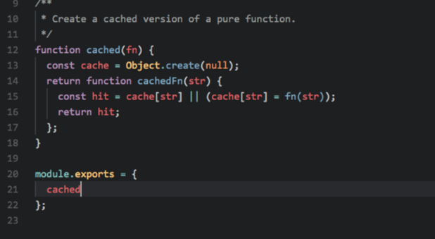
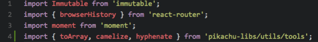
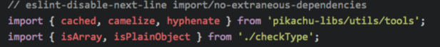
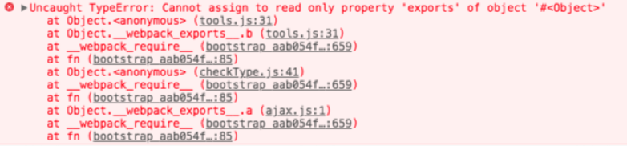
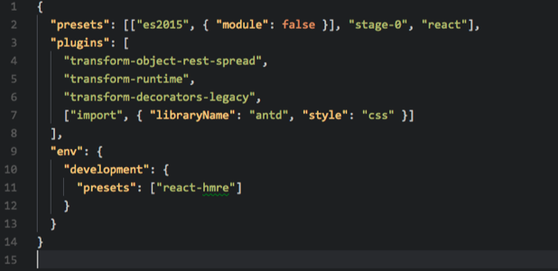
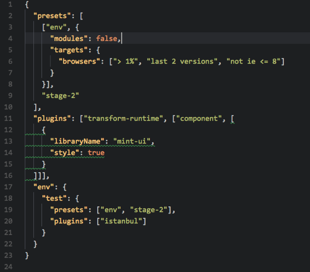
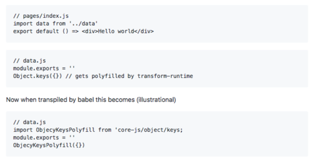
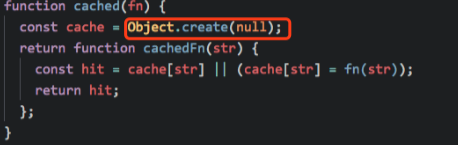
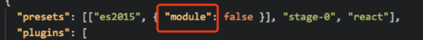
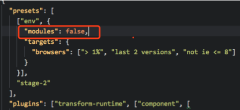

# babel-transform-runtime 踩坑记录

起因是这样的，我在pikachu项目下新建了一个libs文件夹，使用module.exports导出模块。并且在同级的pc和mobile项目下使用npm-link的方式引入了libs模块，在代码中使用es Modules的import引用了该模块，结果PC项目编译正常，mobile项目编译出错。

## 项目代码

libs/index.js



pc/a.js



mobile/b.js



## 别在webpack中混用import和module.exports

添加完代码之后，PC项目运转良好，指标正常，但是mobile项目编译直接抛出异常：



熟悉webpack打包原理的同学都知道，上图报错是因为，webpack不支持在同一个文件中使用Import和module.exports。关于混用这两种方式的讨论，可以查看该issue Cannot assign to read only property 'exports' of object '\#' \(mix require and export\) 如果想了解webpack处理模块引入的基本工作原理，可以参考[import、require、export、module.exports 混合使用详解](https://juejin.im/post/5a2e5f0851882575d42f5609)，这里不展开说明。

肯定有人会问，上面libs/index.js中的代码并没有任何地方使用了import呀。这是一个好问题，我们需要深入到.babelrc中看一看：

pc/.babelrc \(这里面有个坑，大家可以找找茬\)



mobile/.babelrc



虽然两个项目的babelrc配置有一些细节上的差异，但是mobile配置的env模式包括了pc的es2015 preset，所以两者没有特别大的差异。

另外可以发现，两个项目都使用了babel-transform-runtime这个plugin。为什么要提到这个插件呢？使用babel比较多的同学肯定知道，babel可以通过[babel-polyfill](http://babeljs.io/docs/usage/polyfill)或[babel-transform-runtime](https://babeljs.io/docs/plugins/transform-runtime/)来对代码进行transform/compile。而transform-runtime在实际使用过程中，引入polyfill时会使用es Modules import的方式，关于这个行为的细节可以参考[babel-transform-runtime adds `import` in modules that don't use es6](https://github.com/zeit/next.js/issues/3650)

tranform-runtime的转换如图所示。



回到问题本身，因为libs/index.js中使用了Object.create方法，transform-runtime会对这个方法进行polyfill，导致该文件混用了import 和 module.exports



合理使用transform-es2015-modules-commonjs 前面已经说到，导致mobile端报错是因为混用了import 和 module.exports两种写法，但是为什么PC没有报错呢？ 仔细看下PC和mobile的babelrc，可以发现pc的babelrc配置有一处错误

pc/.babelrc



mobile/.babelrc



这个modules参数是个什么东西呢？ 在babel的es2015 presets中包含了一个叫做[transform-es2015-modules-commonjs](https://babeljs.io/docs/plugins/transform-es2015-modules-commonjs/)的plugin。

> **ES2015 modules to CommonJS transform**
>
> This plugin transforms ES2015 modules to CommonJS

```javascript
// input
export default 42;

// output
Object.defineProperty(exports, "__esModule", {
  value: true});
exports.default = 42;
```

官方的解释是，该插件用于将代码中的es Modules写法转化为commonJS写法。与之类似，babel还提供了一下几个插件，支持transform es Modules的写法：

* [es2015-modules-amd](https://babeljs.io/docs/plugins/transform-es2015-modules-amd/)
* [es2015-modules-commonjs](https://babeljs.io/docs/plugins/transform-es2015-modules-commonjs/)
* [es2015-modules-systemjs](https://babeljs.io/docs/plugins/transform-es2015-modules-systemjs/)
* [es2015-modules-umd](https://babeljs.io/docs/plugins/transform-es2015-modules-umd/)

而在直接使用es2015或者env的作为presets时，可以通过 [modules](https://babeljs.io/docs/plugins/preset-env/#modules) 这个参数来控制是否transform es Modules，默认使用commonJS的形式，如果传入false则不启用。

PC的babelrc配置中错误的把modules写成了module，导致PC的babel编译时会将所有的es Module转化为commonJS的写法。 而mobile项目中的配置要求不转化es Modules，于是babel-transform-plugin引入polyfill时采用的import写法就和libs/index.js中的module.exports写法混用了，导致编译失败。

要避免上述问题，直接删掉modules配置项即可。当然也可以修改为其他的模块语法，比如"umd"。

