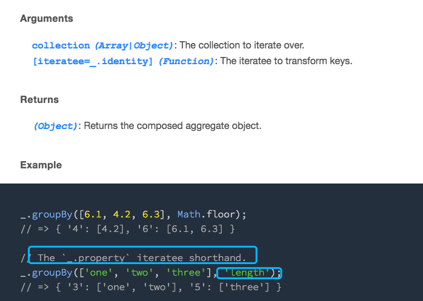
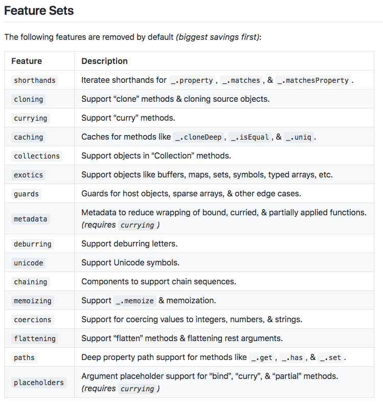

# lodash按需加载注意事项

大家引用lodash的时候，如果想要按需加载，可以考虑使用[webpack-lodash-plugin](https://github.com/lodash/lodash-webpack-plugin#readme)和[babel-plugin-lodash](https://github.com/lodash/babel-plugin-lodash)

```javascript
// 使用前，需要手动引入指定的模块
const isElement = require('lodash/isElement');
const debounce = require('lodash/debounce');

// 使用后，放心引入
import { isElement, debounce } from 'lodash'
```

使用少量lodash代码的，用按需加载可以节省近1MB大小。

使用`webpack-lodash-plugin`时要小心，直接使用该插件不做任何配置时，lodash内部相互引用的方法并不会被注入（官方给的解释是`biggest savings first`）。

最常见的是，某些支持迭代器的方法，只使用shorthand写法非显示调用。按需加载不会加载shorthand的函数。



类似上面这种，按需加载引用`groupBy`时，不会默认加载`property`方法。

配置时可以考虑是否于鏊使用对应的配置。具体可以参考文档设置配置。



